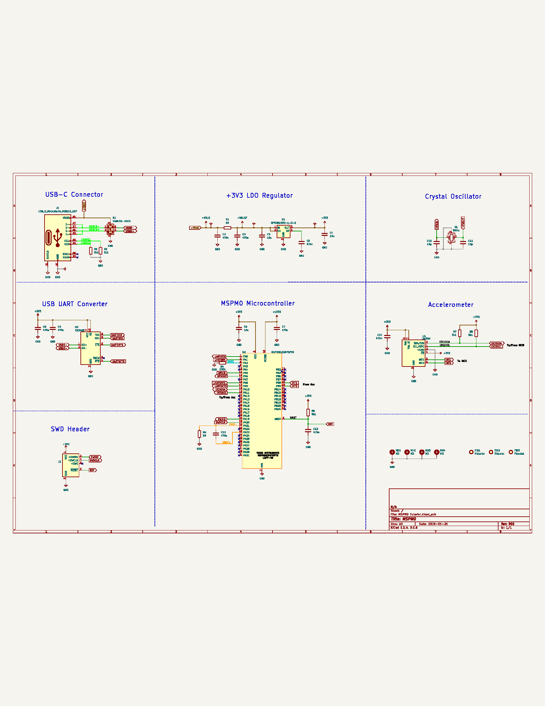
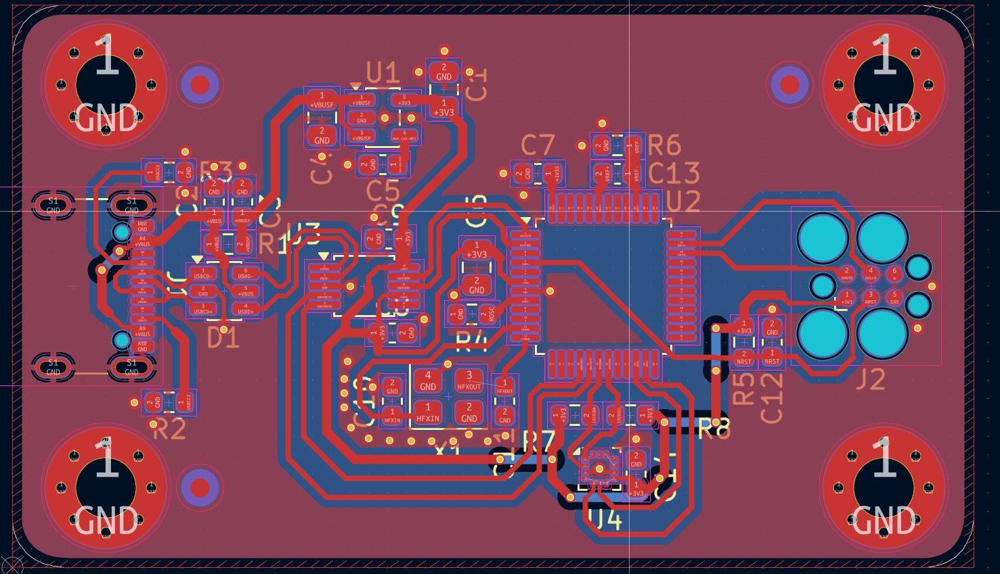
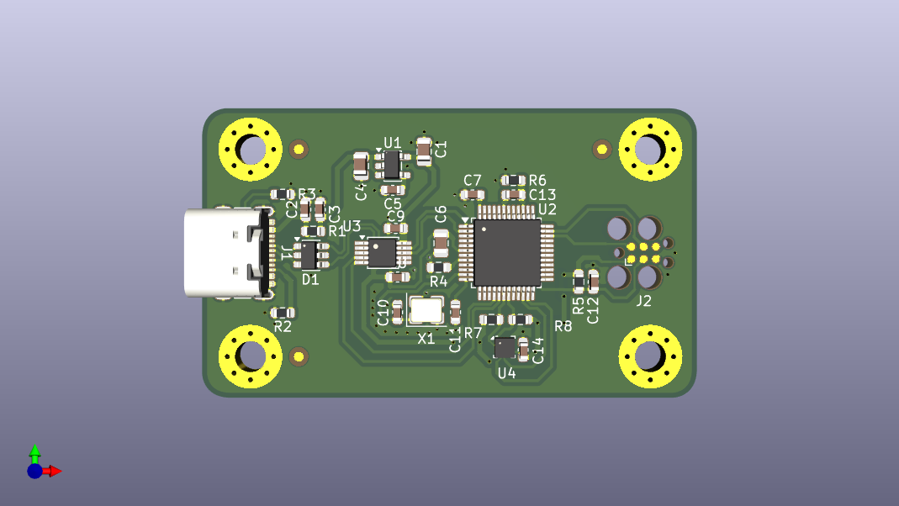

# MSPM0G3507 Microcontroller Development Board

## Overview
This project presents the design of a custom development board based on the Texas Instruments MSPM0G3507 microcontroller. The objective of this project is to explore the workflow of embedded hardware development including schematic design, PCB layout, power regulation, debugging interfaces, and communication peripherals.

The board integrates essential subsystems required for microcontroller operation such as power management, USB-UART communication, clock generation, and SWD debugging support.

---

## Key Features

- MSPM0G3507 ARM Cortex-M0+ microcontroller
- USB-C interface for power input
- 3.3V LDO voltage regulator
- USB-UART communication using CH340
- SWD debugging interface
- External crystal oscillator
- Decoupling and filtering circuitry for stable operation

---

## Hardware Architecture

### USB Interface
- USB-C connector for power input
- VBUS supply input

### Power Regulation
- 3.3V LDO voltage regulator
- Input and output filtering capacitors

### USB-UART Communication
- CH340 USB-to-UART converter
- Serial communication with MCU

### Microcontroller Core
- MSPM0G3507 MCU
- Decoupling capacitors
- GPIO expansion

### Clock Circuit
- External crystal oscillator
- Load capacitors

### Debug Interface
- ARM SWD debug header
- Reset circuitry
## Schematic Preview

---

## PCB Layout

---

## PCB 3D View

---
---
## Learning Outcomes

- Microcontroller hardware integration
- Power supply design for embedded systems
- USB-UART communication interface
- PCB schematic capture and layout
- Decoupling and grounding strategies
- SWD debugging interface design

---

## Future Improvements

- Add sensor interfaces (I2C / SPI peripherals)
- Improve PCB routing for signal integrity
- Add onboard debugging LEDs
- Integrate bootloader support

---
## Tools Used

- KiCad — schematic capture and PCB layout
- Embedded hardware design principles
- PCB routing and layout techniques

---

## License

This project is released for educational and learning purposes.
